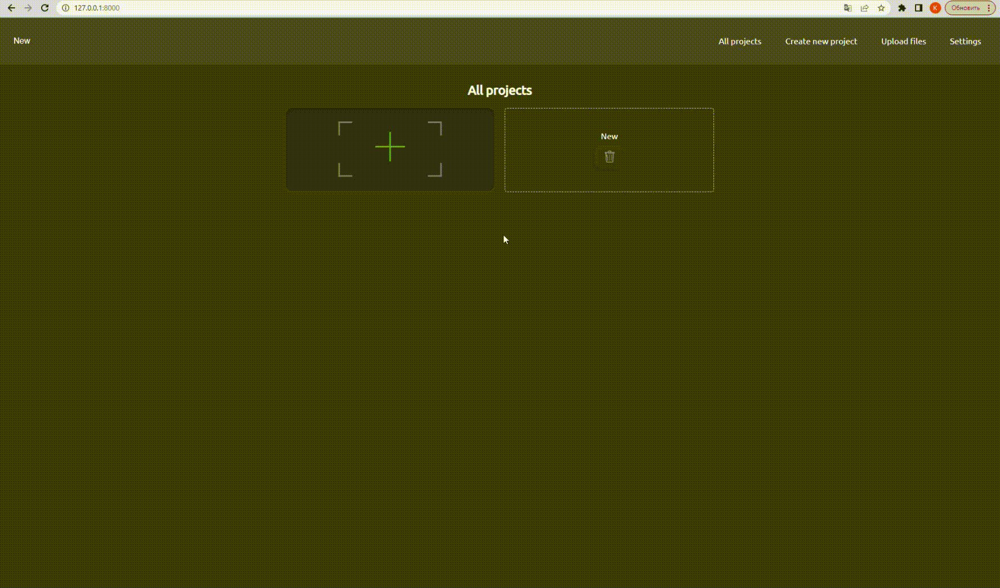
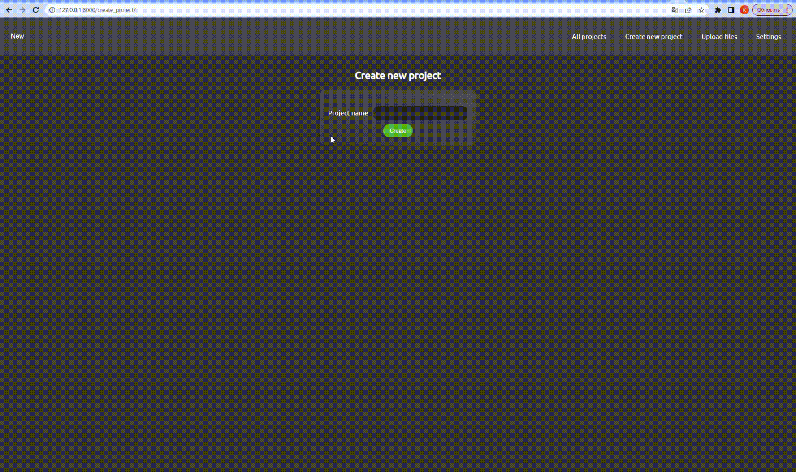
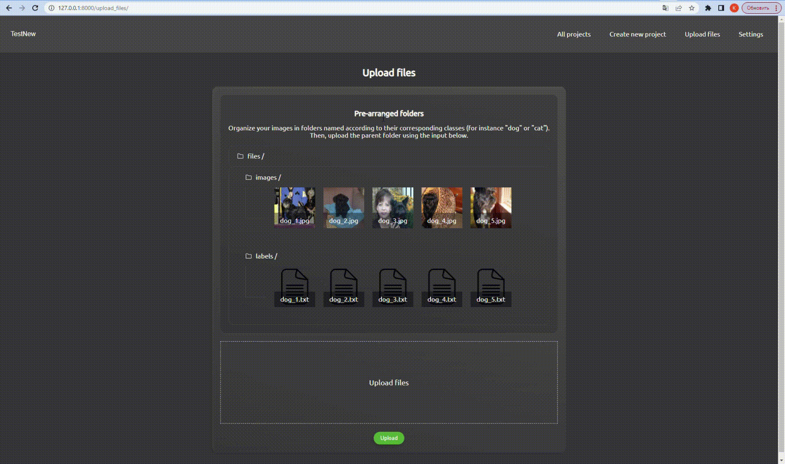
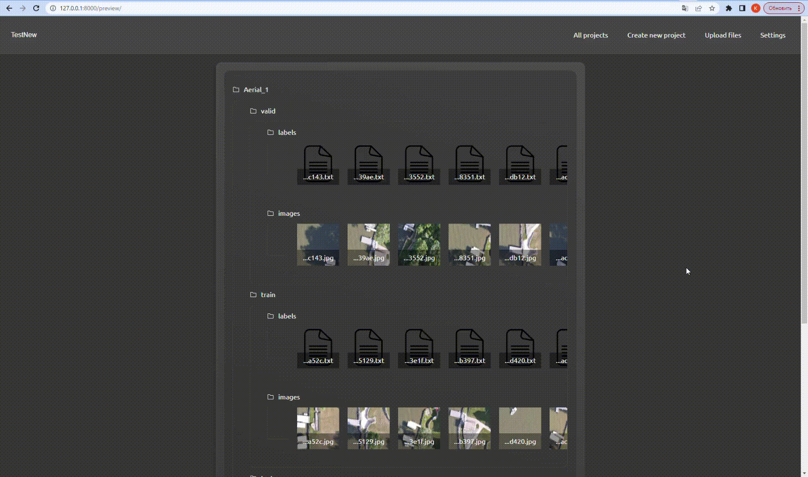
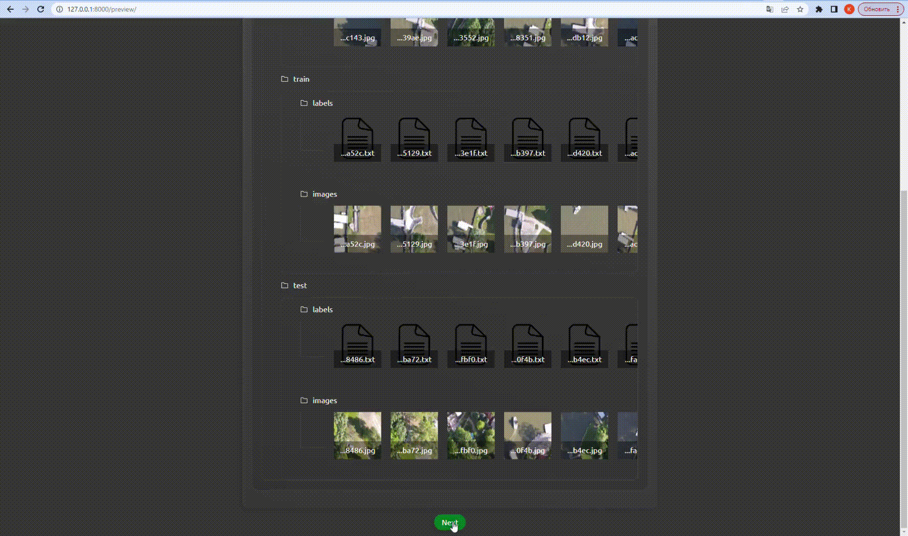
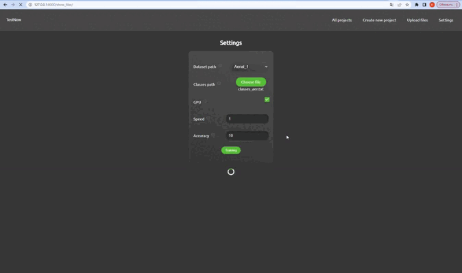

# Autotrain Web Application

The "autotrain_web" project is a web application developed using the Django framework. This interface allows users to upload, train, and manage machine learning models automatically.

## Dependencies

Before running the project, make sure you have the following components installed:

- Docker: https://docs.docker.com/get-docker/
- Docker Compose: https://docs.docker.com/compose/install/

## Cloning the Repository

You can clone the "autotrain_web" project repository using the following command:

```shell
git clone <repository URL>
```

## Project Structure

Your project includes the following files and directories:

- `autotrain_web`: This directory contains Django project configuration files.
- `autotrain`: This directory contains various modules of your Django application, including forms and models.
- `autotrain/ORDC`: This directory is intended for model training and contains relevant files.
- `docker-compose.yml`: File for configuring and running Docker containers.
- `manage.py`: Script for managing the Django project.
- `requirements.txt`: File that lists the Python dependencies required for the project.

## Main Pages

### Home Page

URL: [http://127.0.0.1:8000/](http://127.0.0.1:8000/)



The home page displays all projects. You can click the "Create Project" button to create a new project. Each project can be deleted.

### Create Project

URL: [http://127.0.0.1:8000/create_project/](http://127.0.0.1:8000/create_project/)



When you visit the create project page, you will see a form where you can enter the project name. After submitting the form, the project will be created, and you will be redirected to the file upload page.

### File Upload

URL: [http://127.0.0.1:8000/upload_files/](http://127.0.0.1:8000/upload_files/)



On this page, you need to upload a folder with a minimum depth of 2, containing photos and classes for training. After uploading the files, the preview page will open.

### Preview

URL: [http://127.0.0.1:8000/preview/](http://127.0.0.1:8000/preview/)



The preview page displays the uploaded files. It shows the folder hierarchy, and for each folder, it displays a portion of the files it contains (images or text files). After previewing, you can click the "Next" button to proceed to the configuration settings page.

### Configuration Settings

URL: [http://127.0.0.1:8000/show_files/](http://127.0.0.1:8000/show_files/)



On this page, you need to select the folder you uploaded, and configure the following settings: Dataset path, Classes path, GPU, Speed, Accuracy. After entering all the settings, you can click the "Start Testing" button. It will initiate the selection of the best models for training.

### Results

URL: [http://127.0.0.1:8000/results/](http://127.0.0.1:8000/results/)



The results page displays the top 3 models for training, along with parameters such as Image Count, W, H, Gini coefficient, and Class count. All of this is executed using Docker.

## Running the Project

To run your project, follow these steps:

1. Make sure you have Docker and Docker Compose installed.
2. Navigate to the root directory of your project where the `docker-compose.yml` file is located.
3. Open a terminal and run the following command to start the containers:

```
docker-compose up --build
```

After that, your web application will be available at [http://127.0.0.1:8000/](http://127.0.0.1:8000/).


The "autotrain_web" project is licensed under the [MIT License](LICENSE).
